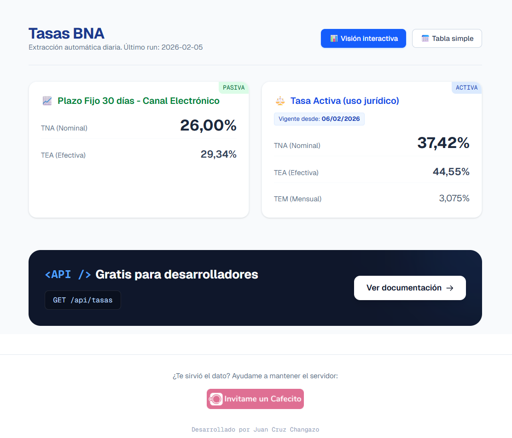

# 🇦🇷 Tasas BNA – API & Dashboard


Este proyecto es una solución **serverless** completa para extraer, almacenar y disponibilizar las tasas financieras activas y pasivas (útiles para casos de uso jurídicos) del **Banco de la Nación Argentina (BNA)** de forma automatizada y abierta.

Combina un **scraper en Python** automatizado con **GitHub Actions**, una base de datos persistente en **Supabase** y un frontend moderno con gráficos interactivos construido con **Next.js**.

## 🚀 Demo & Documentación

- **Dashboard Interactivo:** `https://tasas-bna-api.vercel.app`
- **Documentación API:** `https://tasas-bna-api.vercel.app/api-docs`
- **Endpoint Base:** `GET /api/tasas`

## ✨ Características principales

- **Automatización total:** un cron job extrae los datos diariamente sin intervención humana.
- **API REST flexible:** permite consultar datos históricos, fechas específicas o extraer campos puntuales (TNA, TEA, etc.).
- **Visualización de datos:** gráficos interactivos con Recharts para analizar la evolución histórica.
- **Alta performance:** utiliza **Edge Caching** (`s-maxage`) para responder en milisegundos sin saturar la base de datos.

---

## 🏗 Arquitectura

El sistema funciona de manera autónoma con el siguiente flujo de datos:

1. **Extracción (Daily Cron):** todos los días a las 20:00 (AR), un workflow de **GitHub Actions** ejecuta el script `tasas_bna_light_supabase.py`.
2. **Persistencia:** el script parsea la web oficial del BNA y guarda el resultado (JSON) en **Supabase (PostgreSQL)**.
3. **API Layer:** **Next.js** expone los datos, permitiendo filtrado por *query params*.
4. **Frontend:** interfaz de usuario reactiva con `Tailwind CSS` y `Recharts` para visualización.

---

## 🔌 API Quick Start

La API es pública y tiene **CORS habilitado**. Podés ver la documentación completa en `/api-docs`.

### 1) Últimos datos disponibles

```http
GET /api/tasas
```

### 2) Datos históricos (fecha específica)

```http
GET /api/tasas?date=2024-02-05
```

### 3) Extraer un dato específico (lightweight)

Ideal para widgets o integraciones simples.

```http
GET /api/tasas?field=tasas.activa_judicial.TNA
```

**Respuesta (ejemplo)**

```json
{
  "fecha_dato": "2026-02-06",
  "campo_solicitado": "tasas.activa_judicial.TNA",
  "valor": "37,42%"
}
```

---

## 🛠 Tech Stack

- **Backend / Scraping:** Python 3, BeautifulSoup4, supabase-py
- **Base de Datos:** Supabase (PostgreSQL + JSONB)
- **Frontend / API:** Next.js 14+ (App Router), TypeScript
- **Estilos & UI:** Tailwind CSS, Lucide React
- **Gráficos:** Recharts, date-fns
- **Infraestructura:** Vercel (deploy) & GitHub Actions (CI/CD)

---

## 💻 Desarrollo local

### Prerrequisitos

- Node.js 18+
- Python 3.9+
- Cuenta en Supabase

### 1) Configuración de Base de Datos (Supabase)

Ejecutá el siguiente SQL en el editor de Supabase:

```sql
create table historial_tasas (
  id bigint generated by default as identity primary key,
  created_at timestamp with time zone default timezone('utc'::text, now()) not null,
  fecha_scraping date default current_date,
  datos jsonb not null
);

-- Políticas de seguridad (RLS)
alter table historial_tasas enable row level security;

-- Lectura pública
create policy "Lectura pública"
on historial_tasas
for select
using (true);

-- Escritura (solo con Service Role)
create policy "Insertar backend"
on historial_tasas
for insert
with check (true);
```

### 2) Variables de entorno

Creá un archivo `.env.local`:

```bash
NEXT_PUBLIC_SUPABASE_URL="TU_SUPABASE_PROJECT_URL"
SUPABASE_SERVICE_ROLE_KEY="TU_SUPABASE_SERVICE_ROLE_KEY"
SUPABASE_URL="TU_SUPABASE_PROJECT_URL"
```

> Nota: usá **Service Role Key** para poder escribir en la DB desde el scraper/CI. No la expongas en el cliente.

### 3) Ejecutar el proyecto

#### Scraper (Python)

```bash
pip install -r requirements.txt
python tasas_bna_light_supabase.py
```

#### Frontend (Next.js)

```bash
npm install
npm run dev
```

---

## ⚠️ Disclaimer

Este proyecto no tiene afiliación oficial con el Banco de la Nación Argentina. Los datos se obtienen mediante técnicas de web scraping de fuentes públicas y pueden contener errores o quedar desactualizados si cambia la estructura de la web oficial. Usalo bajo tu propia responsabilidad.

---

## Créditos

Si te sirvió este proyecto, considerá darle una estrella en GitHub ⭐

Buena vida,  
Juan Cruz


